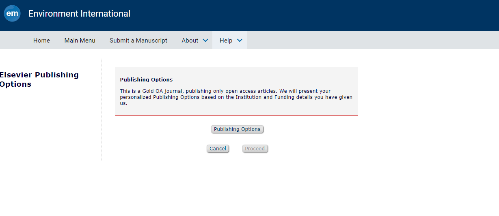
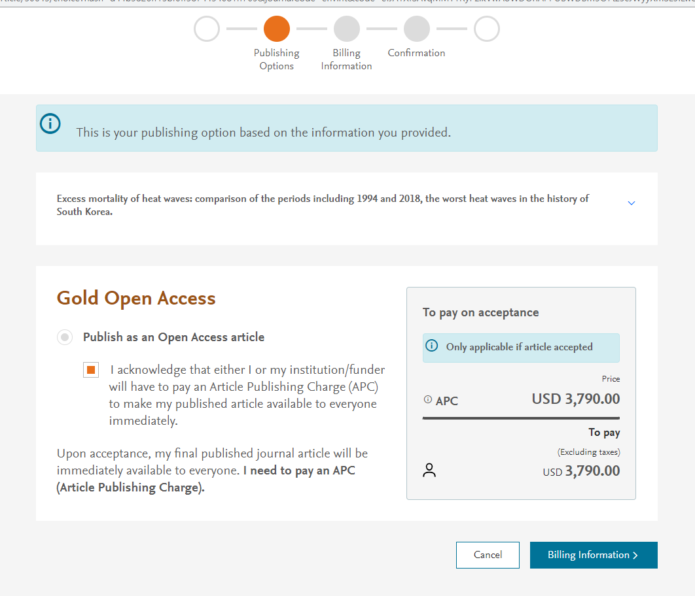

# 예방의학교실

 

## 폭염 사망영향 논문
- 관련자료: [manuscript](https://www.dropbox.com/s/dpchmavxnru56pc/manuscript_v6.docx?dl=0), [cover letter](https://www.dropbox.com/s/7tj9p6tmw8ceaxi/cover_letter.docx?dl=0), [declaration statement](https://www.dropbox.com/s/7qhtzbbsav8lwt1/declarationStatement.docx?dl=0), [figures](https://www.dropbox.com/s/ovgricll03q3wxp/figures.docx?dl=0), [tables](https://www.dropbox.com/s/docv4wr01nwy9t8/tables.docx?dl=0), [graphical abstract](https://www.dropbox.com/s/gcmrkwa7fua94el/graphical%20abstract.png?dl=0), [highlights](https://www.dropbox.com/s/0kilf62j6zd00t1/highlights.docx?dl=0) 
- 타겟저널: [Environment International](https://www.sciencedirect.com/journal/environment-international)
  + Impact factor = 13.352
  + open access로만 publish가능해서, accept가 되면 **$3790** 지불 필요.
  
  

  + 다른 타겟 저널 선정 고려 필요성.
  + 최경화 교수님 추가 의견: graphical abstract보완, 표형태변경, 참고문헌추가, 내용보완 등 almost everything 반영.
  + 추진상황:

| 주제선정 | 데이터분석 | 배경 | 방법 | 결과 | 고찰 | 영문교정 | 논문제출 | 리비전 | 퍼블리쉬 |
| :--------: | :--------: |  :--------: |  :--------: |  :--------: |  :--------: |  :--------: |  :--------: |  :--------: |  :--------: | 
| :white_check_mark: | :white_check_mark: | :white_check_mark: | :white_check_mark: | :white_check_mark: | :white_check_mark: | :white_check_mark: |:triangular_flag_on_post: |  |  |

 

## 코로나19판데믹 영향 논문
- [관련파일](https://www.dropbox.com/sh/k98zqkuquxmzeez/AAAjgxW_wfEzr8a-Bq69MOhGa?dl=0)
- 타겟저널: 미정
- **먼저 계획서 작성하여 IRB 추진 예정**

  
  
  
  
    
 
