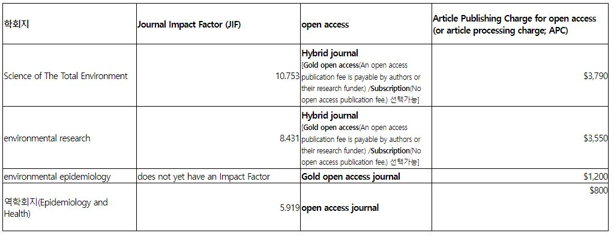
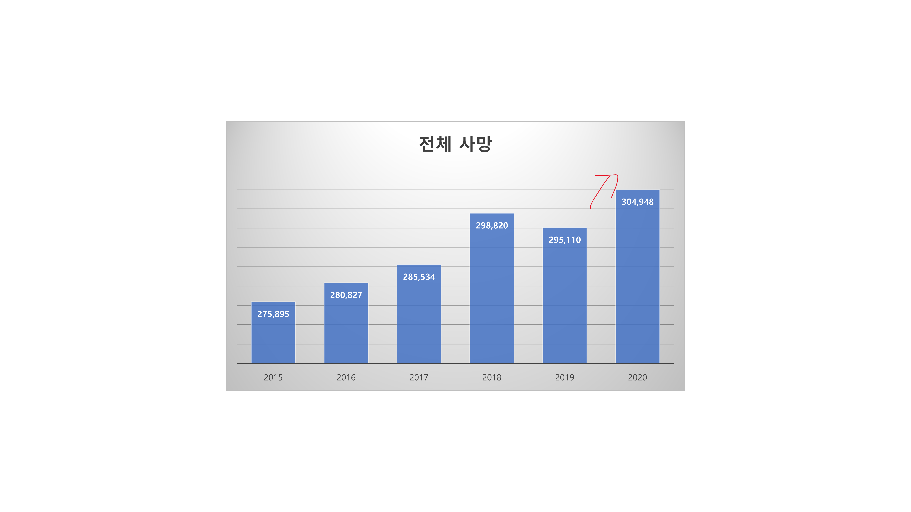
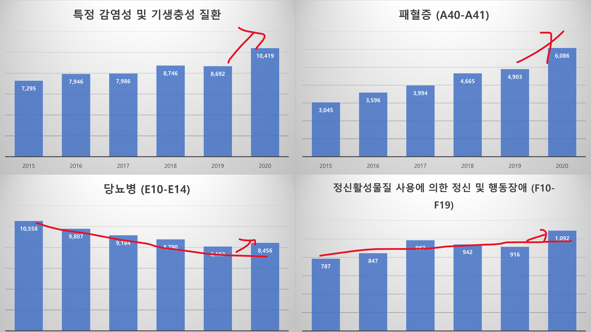
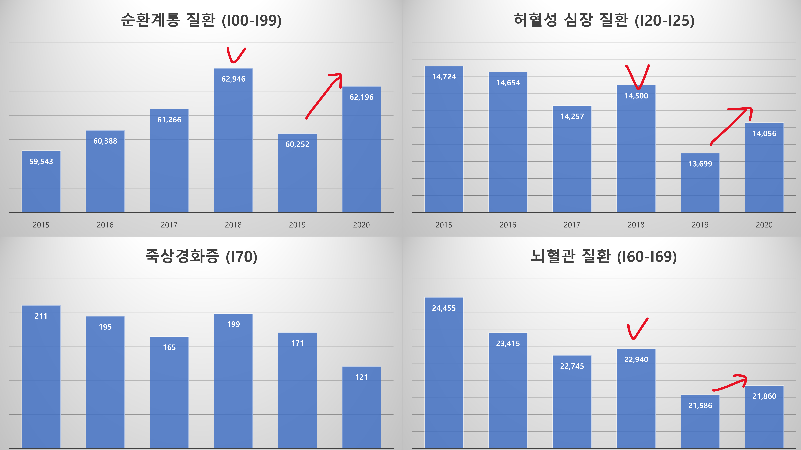
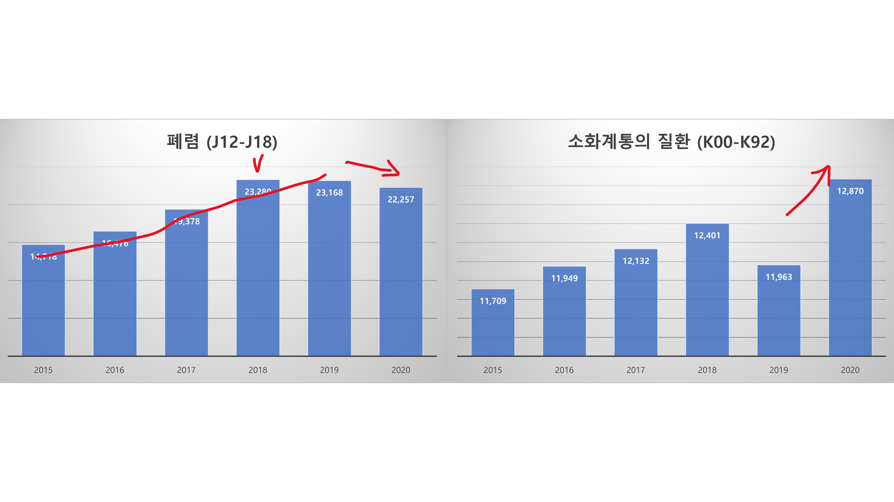

# 예방의학교실

 

## 폭염 사망영향 논문
- 관련자료: [manuscript](https://www.dropbox.com/s/dpchmavxnru56pc/manuscript_v6.docx?dl=0), [cover letter](https://www.dropbox.com/s/7tj9p6tmw8ceaxi/cover_letter.docx?dl=0), [declaration statement](https://www.dropbox.com/s/7qhtzbbsav8lwt1/declarationStatement.docx?dl=0), [figures](https://www.dropbox.com/s/ovgricll03q3wxp/figures.docx?dl=0), [tables](https://www.dropbox.com/s/docv4wr01nwy9t8/tables.docx?dl=0), [graphical abstract](https://www.dropbox.com/s/gcmrkwa7fua94el/graphical%20abstract.png?dl=0), [highlights](https://www.dropbox.com/s/0kilf62j6zd00t1/highlights.docx?dl=0) 
- 최경화 교수님 추가 의견: graphical abstract보완, 표형태변경, 참고문헌추가, 내용보완 등 almost everything 반영.
- 타겟저널:
  
  + STOTEN: reject.
  + **Environmental Research 타깃으로 재추진(진행중).**
  + 추진상황:

| 주제선정 | 데이터분석 | 배경 | 방법 | 결과 | 고찰 | 영문교정 | 논문제출 | 리비전 | 퍼블리쉬 |
| :--------: | :--------: |  :--------: |  :--------: |  :--------: |  :--------: |  :--------: |  :--------: |  :--------: |  :--------: | 
| :white_check_mark: | :white_check_mark: | :white_check_mark: | :white_check_mark: | :white_check_mark: | :white_check_mark: | :white_check_mark: |:triangular_flag_on_post: |  |  |

 

## 코로나19판데믹 영향 논문
- [관련파일](https://www.dropbox.com/sh/k98zqkuquxmzeez/AAAjgxW_wfEzr8a-Bq69MOhGa?dl=0)
- 타겟저널: 미정
- **먼저 계획서 작성하여 IRB 추진 예정**
- **계획서 Outline**

  1. 연구배경
  
      - Background on COVID-19: 바이러스, 감염 및 유행병의 현재상태에 대한 배경 서술.
      - Impact on healthcare systems: 병원서비스에 수요증가, 의료 제공방식 변화, 의료접근성, 행동변화, 의료 시스템에 미치는 판데믹의 영향 서술.
      - Potential effects on other diseases: 다른 질병 발생 및 사망에 어떻게 영향을 미쳤는지 서술.
      - Research gap: 팬데믹이 다른 질병에 미치는 영향에 대한 이전연구 현황. 본 연구 필요성 서술.
      - objective: 연구목적 서술.
    
  2. 연구질문: "코로나19 범유행이 다양한 질병의 발생과 사망에 어떤 영향을 미쳤는가?"
  
  3. 연구방법
  
      - Study design: Study design 설명
      - Data analysis plan: 수행할 통계 분석의 개요
      - Participants
        + Inclusion and exclusion criteria
        + Sample size calculation
      - Data collection
        + Data collection method
        + Data variables
      - Data analysis
        + Statistical analysis
        + Interpretation: 연구 질문에 답하는 데 어떻게 사용될지 서술.
      
  3. 기대효과: 이 연구가 코로나19 판데믹이 미치는 영향을 이해하고, 앞으로 판데믹에 어떻게 대응해야 하는지 이해하는데에 어떻게 기여할지 서술.
  
  4. 그 외 IRB 승인을 받기 위한 윤리적 고려사항 서술.

  
  
  
  
    
 
